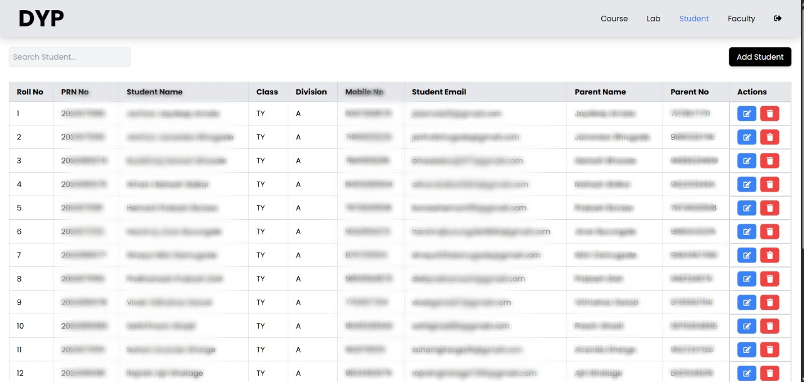

# 🎓 Smart Attendance System

A digital attendance solution designed to eliminate the hassles of traditional attendance systems. This platform offers an efficient, centralized way for **admins**, **faculty**, and **students** to manage and track attendance data with real-time functionality.

---

## 🧠 Why Smart Attendance?

Traditional attendance methods are slow, error-prone, and not scalable. The **Smart Attendance System** brings convenience to educational institutions by enabling:

- 📱 Online attendance marking from any device
- 🎯 Role-based dashboard access
- 📊 Defaulter tracking and data export
- 👨‍🏫 Easy session scheduling
- 👨‍🎓 Transparent student access

---

## 🧑‍💼 User Roles & Capabilities

### 🛠️ Admin

- Add/remove faculty and students
- Grant dashboard access
- Maintain system integrity

### 👩‍🏫 Faculty

- View or create lecture/lab sessions
- Mark attendance
- Track defaulters
- Export defaulter list (Excel)

### 👨‍🎓 Student

- View attendance by subject/session
- Separate records for lectures and labs

---

## 📸 Project Screenshots





---

## 💻 Tech Stack

| Tech        | Description                    |
| ----------- | ------------------------------ |
| React.js    | Frontend framework             |
| Node.js     | Backend runtime                |
| Express.js  | Web framework for Node.js      |
| MongoDB     | NoSQL Database                 |
| TailwindCSS | Styling and layout             |
| ExcelJS     | For Excel export functionality |

---

## 🚀 Getting Started

Follow these steps to run the project locally. Make sure you have **Node.js** and **npm** installed on your machine.

---

### 🔧 Step-by-Step Setup

Open your terminal and run the following commands **in order**:

---

### 1️⃣ Start the Backend

```bash
cd backend
npm install
npm start
```

### 2️⃣ Start the Admin Dashboard

```bash
cd ../admin
npm install
npm run dev
```

### 3️⃣ Start the Faculty Dashboard

```bash
cd ../faculty
npm install
npm run dev
```

### 4️⃣ Start the Student Dashboard

```bash
cd ../student
npm install
npm run dev
```

---

## 📝 Note

Before using the system, **create your own MongoDB database** and update the connection string in the backend configuration.  
Then, use [Postman](https://www.postman.com/) (or a similar API tool) to access the `/admin` route and create your first
Also make sure before login to the other dashboard make sure to logout the current user
